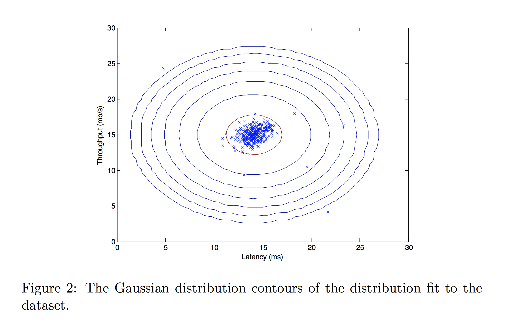
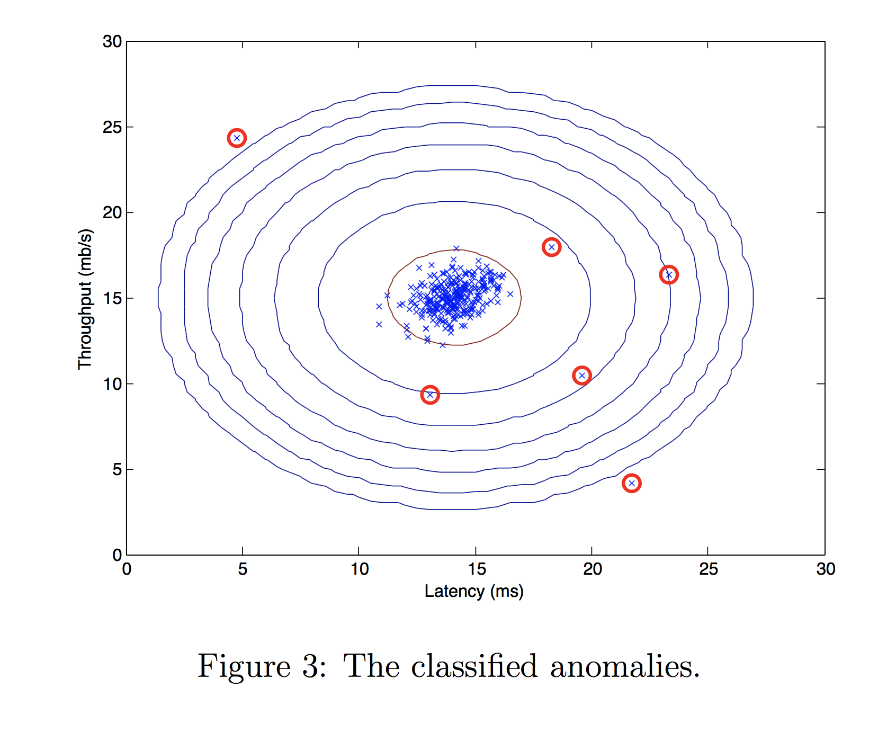

> This project demonstrates probabilistic anomaly detection using Gaussian modelling for identifying abnormal system behaviour.

# 📌 Anomaly Detection for Predictive Server Failure
Early detection of abnormal server behaviour is critical to prevent downtime, financial losses, and service disruption.
This project implements an anomaly-detection model to identify failing servers based on system performance metrics, using statistical learning techniques.
The goal is to distinguish normal operational patterns from abnormal behaviour through probabilistic modelling and threshold-based decision making.

## 📊 Dataset
The dataset consists of server performance metrics such as:
- CPU utilization
- Memory usage
- Network throughput
- Latency indicators

The data includes both normal operating conditions and labelled failure events.

## ⚙️ Methodology
The project applies a Gaussian-based anomaly detection approach:
- Feature distribution modelling using multivariate Gaussian estimation
- Computation of probability density for each observation
- Threshold selection using validation data
- Classification of anomalous server states

This probabilistic approach is particularly effective when failure examples are rare.

## 📈 Results
The model successfully identifies abnormal server behaviour with:
- Clear separation between normal and anomalous observations
- Effective threshold selection
- Minimal false positives after tuning
- Visualisation of probability contours and anomaly clusters demonstrates the robustness of the detection process.

### Detected anomalies 
 

### Gaussian contour visualization 
 

### Threshold selection 
 

## 🧠 Key Learning Outcomes
- Practical understanding of probabilistic anomaly detection
- Handling imbalanced datasets
- Threshold optimisation using validation data
- Importance of feature distribution assumptions

## 🚀 Future Improvements
- Isolation forest and autoencoder comparison
- Real-time streaming anomaly detection
- Feature engineering for improved sensitivity
- Deployment as a monitoring alert system

## 🛠️ Technologies Used
- Python
- NumPy & Pandas
- Matplotlib
- Scikit-learn

## Source
Source file is available in the files section or can be accessed [here](https://github.com/Toqeer-Ahmad/Anomaly-Detection/blob/main/08-Anomaly%20Detection.ipynb)

## Repository Structure 
data/ → training and validation datasets 
images/ → visualization outputs 
08-Anomaly Detection.ipynb → main implementation notebook 
utils.py → helper functions 
public_tests.py → evaluation utilities 
